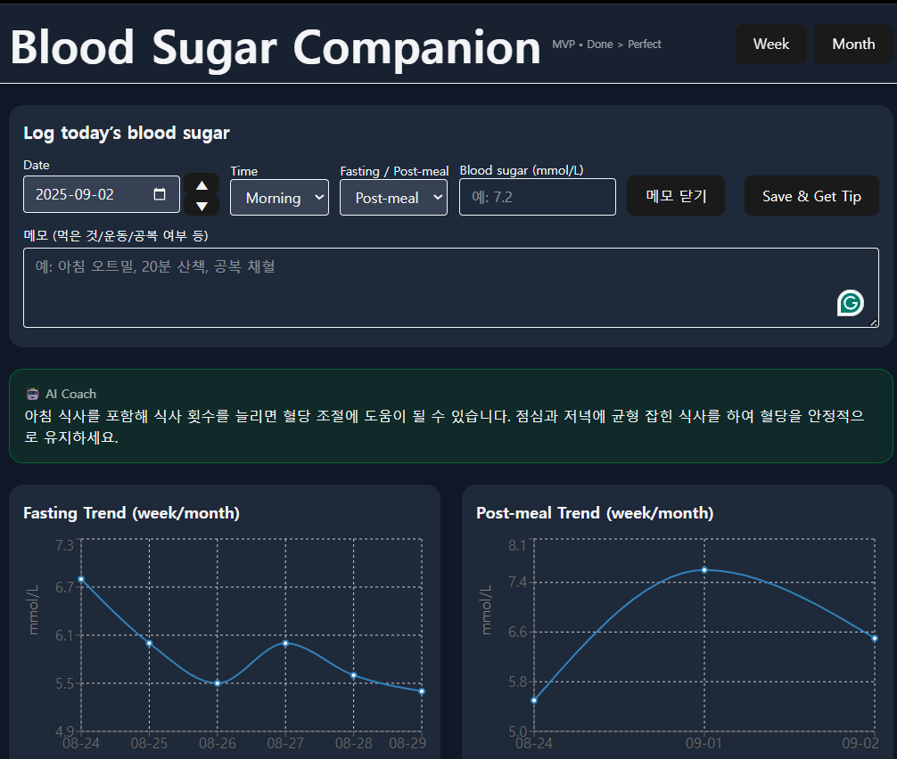
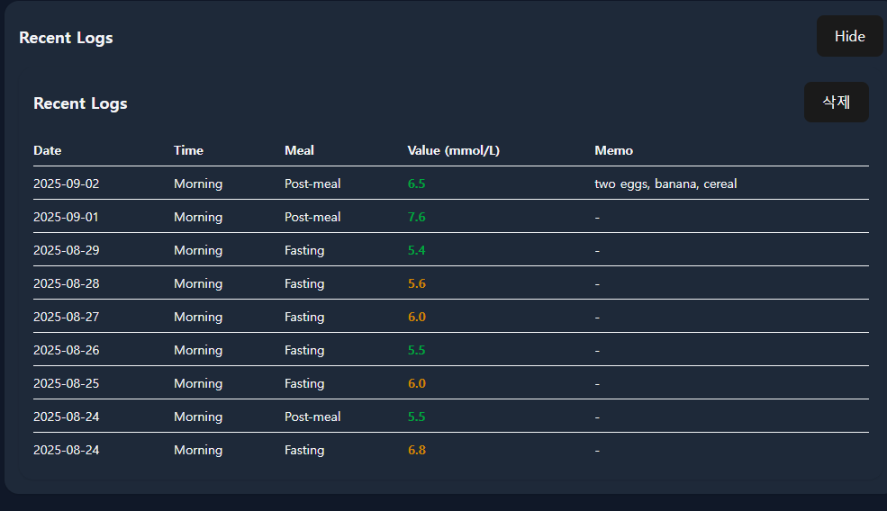

## 📸 Screenshots

### Log Form

### Charts

### Weekly AI Summary

# 🩺 Blood Sugar Companion

A **full-stack web app** to help people log and visualize their blood sugar levels.  
Built as part of a **6-week project challenge** (1 project every 3 days).

---

## ✨ Features

- 📅 **Daily Logging**
  - Enter blood sugar in **mmol/L** with date/time & fasting/post-meal option
  - Add **personal notes** (meal, exercise, fasting status)

- 📊 **Graphs & Trends**
  - Separate charts for **Fasting** vs **Post-meal** blood sugar
  - Dynamic Y-axis with mmol/L units
  - Hover tooltips for exact values

- 📋 **Recent Logs**
  - Expand/collapse toggle to keep UI clean
  - Delete mode with checkboxes for bulk removal

- 🧠 **AI-Powered Insights**
  - **Weekly summary** (7-day average + biggest spike + lifestyle analysis from notes)
  - **Personalized coach tips** after each log entry
  - Profile goals & lifestyle settings influence AI feedback

---

## 🛠️ Tech Stack

**Frontend**
- React + Vite
- Tailwind CSS
- Recharts (for graphs)

**Backend**
- Node.js + Express
- SQLite (via better-sqlite3)
- OpenAI API (GPT-4o-mini for AI summaries)

**Deployment**
- Frontend → Vercel/Netlify
- Backend → Render/Railway/Heroku

---

## 📂 Project Structure
blood-sugar-companion/
│
├── src/ # React frontend
│ ├── components/ # UI components (LogForm, LogsTable, TrendChart, ...)
│ ├── App.jsx # Main entry
│ └── utils.js # Helpers (date shift, unit conversion, status colors)
│
├── server/ # Express backend
│ ├── index.js # API routes (logs, profile, summaries, coach)
│ └── data.db # (local SQLite DB - ignored in git)
│
├── .gitignore # Ignored files (node_modules, .env, data.db, build)
├── package.json # Dependencies
└── README.md # Project docs

---

## 🚀 Getting Started

### 1. Clone the repo
git clone https://github.com/<your-username>/blood-sugar-companion.git
cd blood-sugar-companion

### 2. Install dependencies
npm install
cd server && npm install

### 3. Add environment variable
Create a file: server/.env.local
OPENAI_API_KEY=your_openai_api_key_here

### 4. Run backend
cd server
npm start

### 5. Run frontend
Open a new terminal:
npm run dev

### 6. Open in browser
Visit 👉 http://localhost:5173

### ⚠️ Disclaimer

This app is a personal project prototype.
It is not a medical device and should not be used for clinical decision making.
Always consult your healthcare provider for medical advice.
